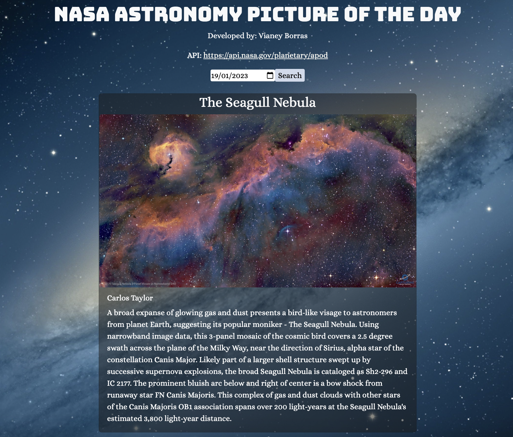

# NASA Astronomy Picture Of The Day 🌌 ✨ 💫
NASA | APOD is a React app that uses the [APOD API](https://api.nasa.gov/planetary/apod) to display an astronomical picture with an explanation based on a given date.

Visit the app at: https://nasa-apod-vianey.netlify.app/

## Technologies used 💻
- HTML
- CSS
- JavaScript
- React

## Author 👤
- [VianeyAileen](https://github.com/VianeyAileen)